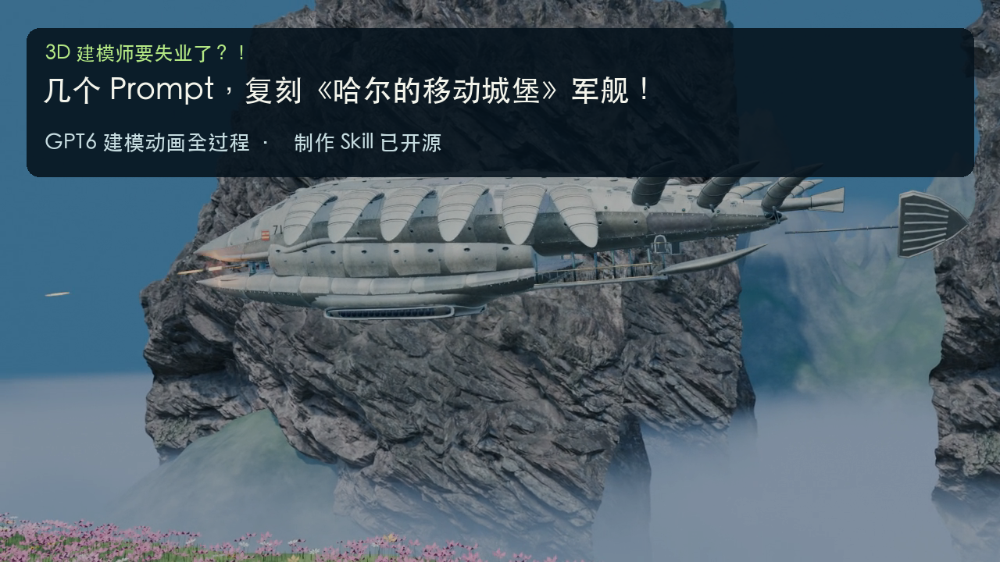

# 3D 建模师要失业了？！

**简单几步，让 GPT6 帮你生成高精度 3D 模型和动画**

[](media/GPT6-3D-making-of.mp4)

104 秒制作过程视频，720p / 24fps，使用 MiniMax 克隆声音配音。开头 10 秒展示成片，中间保留阶段图片与关键提示词，片尾 20 秒完整展示三个已有镜头且无解说，最后加 4 秒点赞订阅。此次更新没有新增或重新渲染 3D 镜头。

**[观看 / 下载完整视频](media/GPT6-3D-making-of.mp4)** · **[阅读 Skill](skills/reference-to-blender-video/SKILL.md)** · **[过程图片与提示词](docs/process.md)**

## 安装 Skill

将仓库中的 `skills/reference-to-blender-video` 目录复制到你的 Codex skills 目录。

```bash
git clone https://github.com/375432636/gpt6-blender-video-skill.git
mkdir -p "${CODEX_HOME:-$HOME/.codex}/skills"
cp -R gpt6-blender-video-skill/skills/reference-to-blender-video "${CODEX_HOME:-$HOME/.codex}/skills/"
```

已有同名 skill 时先查看并合并修改。开始一个新任务后，可以这样调用：

```text
使用 $reference-to-blender-video，根据我提供的参考图完成 Blender 模型、
同模型三视图和运镜动画，再把真实过程与关键提示词剪成视频。
```

Skill 包含建模与比例检查、动作和运镜、预览到正式渲染、过程视频剪辑、发布链接整理，以及一个实际帧率与帧数检查器。它会复用用户已认可的工程，按任务所处阶段继续。

## 视频素材

| 文件 | 规格 |
| --- | --- |
| [完整制作过程](media/GPT6-3D-making-of.mp4) | 104 秒，720p / 24fps，含解说 |
| [三镜头合集](media/three-camera-showcase-20s.mp4) | 20 秒，720p / 24fps，无解说 |
| [主镜头](media/A-dramatic-10s.mp4) | 10 秒，720p / 24fps |
| [高位俯冲](media/B-high-angle-5s.mp4) | 5 秒，720p / 24fps |
| [低位掠过](media/C-low-pass-5s.mp4) | 5 秒，720p / 24fps |
| [正式渲染前的运镜预览](media/camera-preview.mp4) | 20 秒，480×270 / 12fps |

另附 [中文字幕](media/subtitles.zh-CN.srt)、[解说文稿](docs/narration.md)、[成片分镜图](media/video-contactsheet.png) 和 [可复制的视频描述](docs/video-description.md)。

## 视频描述

从参考图、三视图、Blender 建模到比例与细节迭代，最后进入运镜动画。制作过程保留真实阶段图与反馈，片尾完整展示 10 秒主镜头和两个 5 秒角度。

- 项目与视频：https://github.com/375432636/gpt6-blender-video-skill
- 可复用 Skill：https://github.com/375432636/gpt6-blender-video-skill/blob/main/skills/reference-to-blender-video/SKILL.md
- 过程图片与提示词：https://github.com/375432636/gpt6-blender-video-skill/blob/main/docs/process.md

相同链接已写入公开 MP4 的 `description` / `comment` 元数据。复制发布文案时可直接使用 [video-description.md](docs/video-description.md)。

## 检查与素材来源

完整视频实际解码为 2496 帧。片尾 480 帧与既有三个镜头逐帧一致，成果展示区间的独立配音轨为静音。成片响度为 -16.04 LUFS，峰值为 -1.50 dBTP。可用 skill 附带的检查器复核：

```bash
python skills/reference-to-blender-video/scripts/validate_video.py media/GPT6-3D-making-of.mp4 --width 1280 --height 720 --fps 24 --seconds 104 --require-audio
```

工具需要 Python 3 与 ffprobe。Blender 建模和剪辑还需要本机 Blender、FFmpeg、字体及适合所选方式的音频工具。具体路径由运行环境发现。

本例模型和场景根据用户参考制作；岩壁使用 [Poly Haven Mountainside](https://polyhaven.com/a/mountainside) 的 CC0 扫描素材。中文解说使用用户指定的 MiniMax 克隆音色合成，背景音由正弦波与过滤噪声合成。标题使用悬念表达，视频内容展示参考、反馈与多轮迭代。
