# 从参考图到三维动画：本次制作过程

视频里的关键提示词为复盘提炼。生成设定图、工作预览与实际 Blender 渲染分别标注；并未把设定图当作操作录屏。隐藏结构与内部布局包含参考推演。

整体比例校准与细节调整经历了多轮反馈。测得的长宽高比例误差只说明整体比例，不能代替局部轮廓与实际工程尺寸验证。

## 00:00–00:05　先看成片

这艘飞船，从参考图走进了花海峡谷。

## 00:05–00:15　参考图变成设定

提示词（复盘提炼）：

```text
依据 11 张截图整理飞船设定
保留双层船首、分节翼和旧金属
可见结构与推演部分分别标明
```

先抓双层船首、分节翼和旧金属特征。

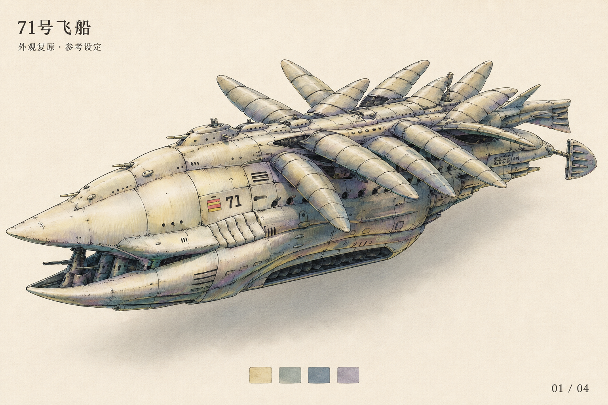

由 11 张截图整理的外观设定

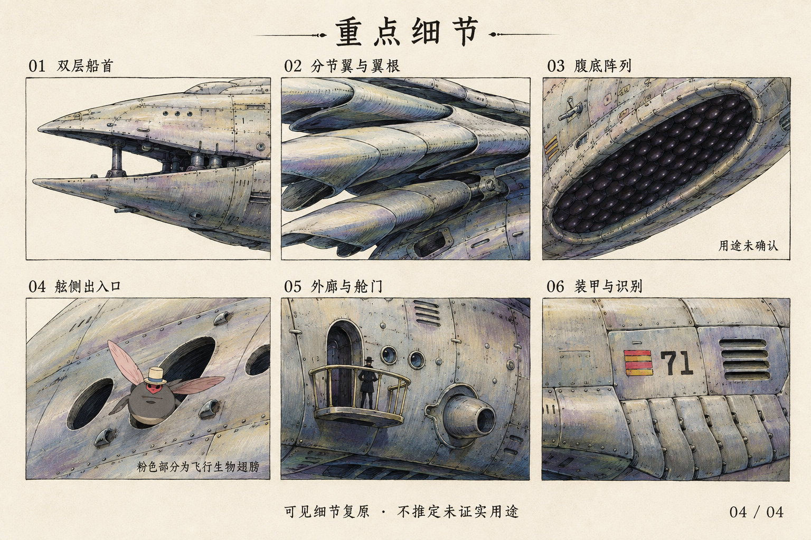

重点细节设定图

## 00:15–00:26　先统一三视图

提示词（复盘提炼）：

```text
生成俯视、侧视、正视三视图
保持船长、翼根位置与姿态一致
用对齐线检查，避免透视混入
```

同一艘船，三个方向；先把比例说清楚。

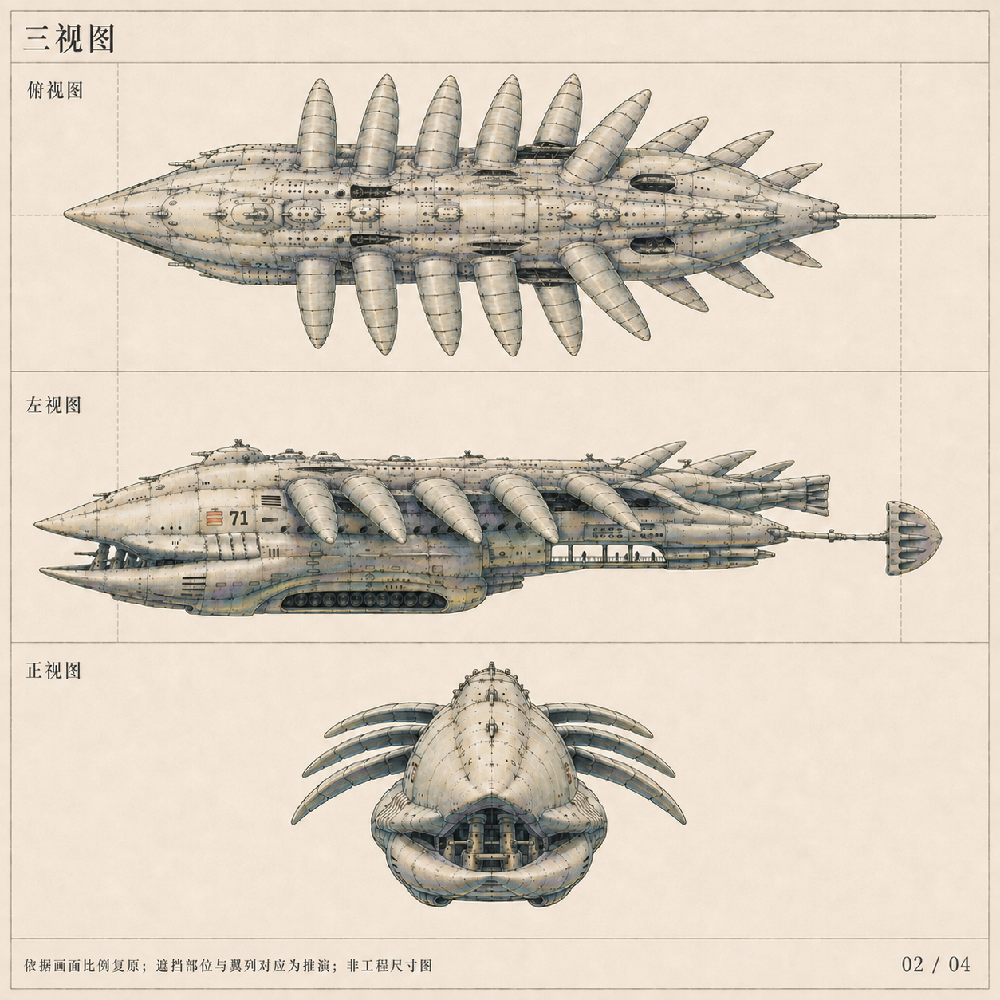

概念三视图 · 建模参考

## 00:26–00:32　拆出内部与细节

提示词（复盘提炼）：

```text
拆解拱顶走廊、环框机组与外廊
补充翼根、腹底阵列和装甲近景
未确认的结构用途不要编造
```

从外壳往里拆，建模才有可执行的细节。

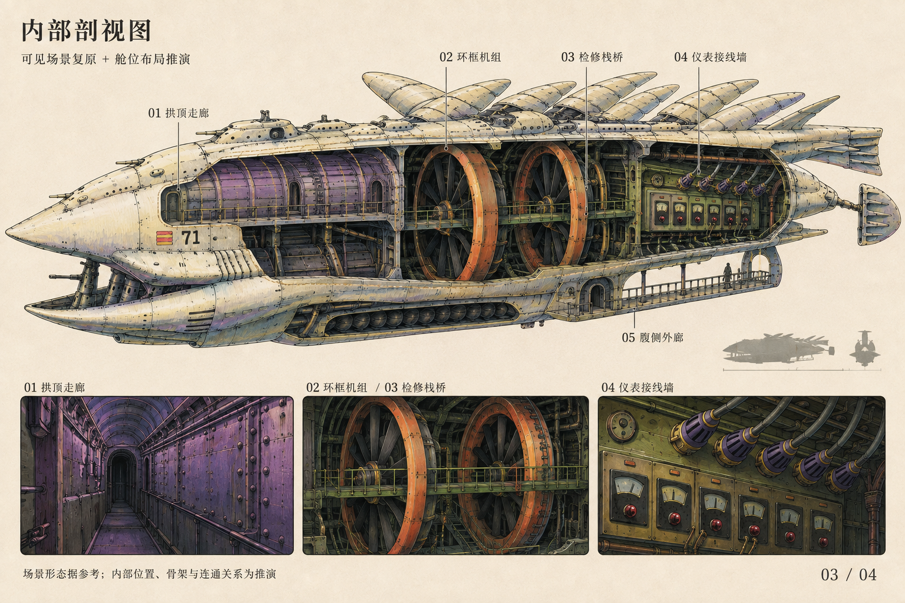

内部剖视设定 · 舱位关系为推演


重点细节设定图

## 00:32–00:44　让设定进入三维

提示词（复盘提炼）：

```text
用 Blender 建立可编辑飞船模型
加入花海峡谷、岩壁与云雾
先看预览，再完善材质和灯光
```

先搭出真实场景，再逐轮修正形体与材质。

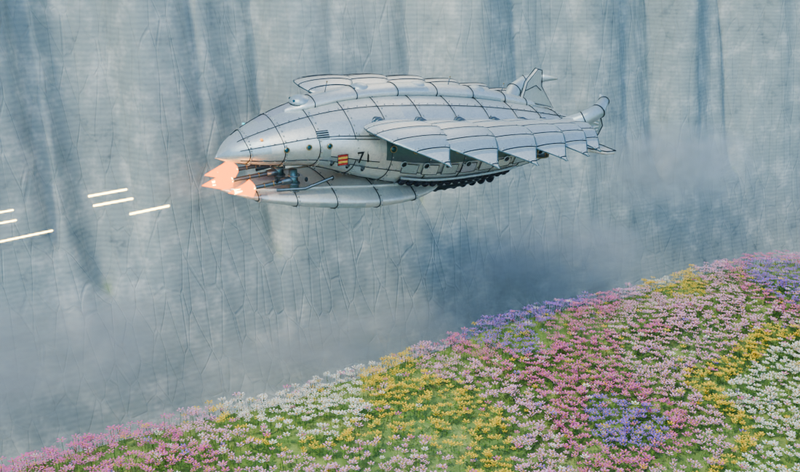

V1 草模预览

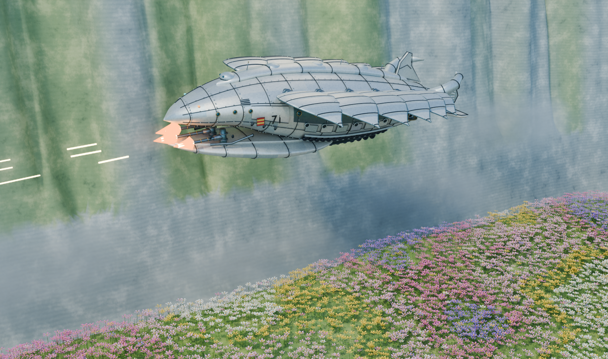

V1 场景渲染

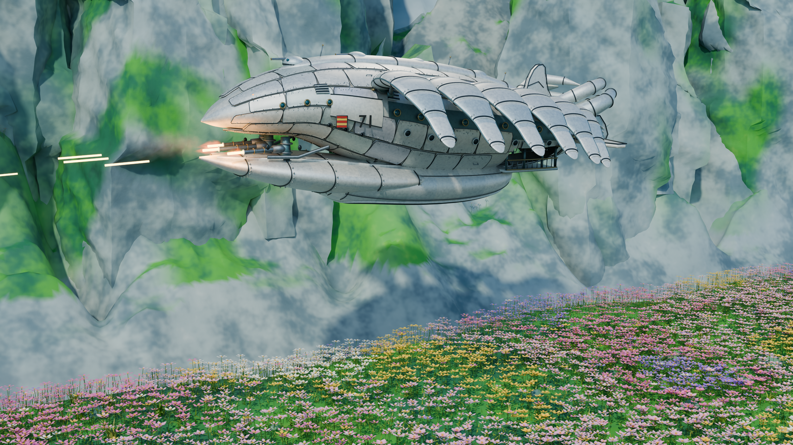

V2 细化版场景

## 00:44–00:56　比例不对就重来

提示词（复盘提炼）：

```text
按参考校准总长、翼展和高度
同步修改翼根位置与前部开口
从同一模型渲染三视图对照
```

从“看起来像”，推进到能对照检查。

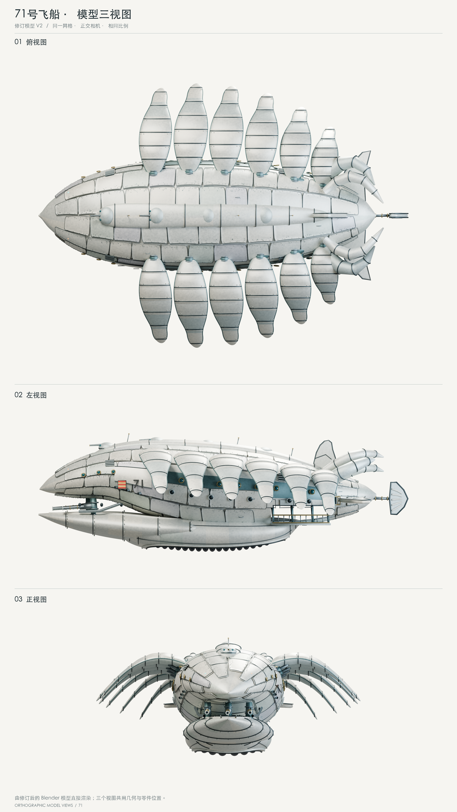

V2 实际模型三视图

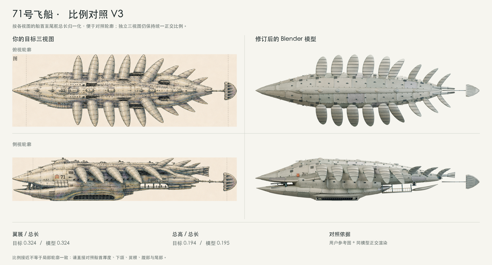

V3 参考与实际模型比例对照

## 00:56–01:04　把细节补到位

提示词（复盘提炼）：

```text
细化铆钉、翼根、腹腔和外廊
增加岩壁纹理与前景花草层次
保持场景和三视图使用同一模型
```

船体有结构层次，峡谷有岩石和花草层次。

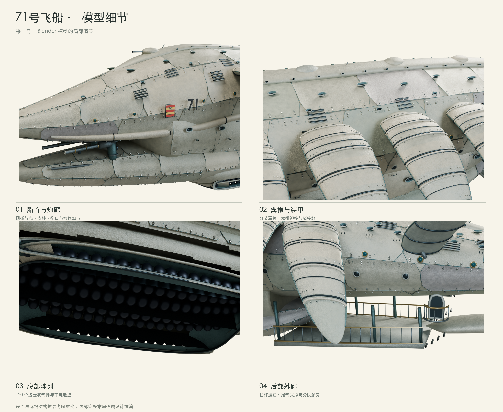

V3 实际模型局部渲染

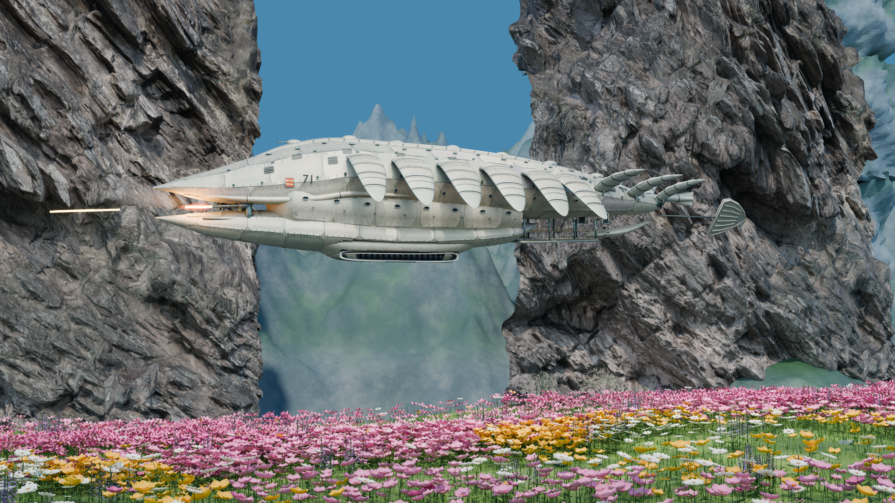

V3 最终场景渲染

## 01:04–01:15　最后才是运镜

提示词（复盘提炼）：

```text
先预览新运镜，再输出最终动画
设计接近、掠过、拉远的镜头节奏
按 720P、24fps 逐帧渲染
```

先把模型做稳，再用镜头制造速度和压迫感。

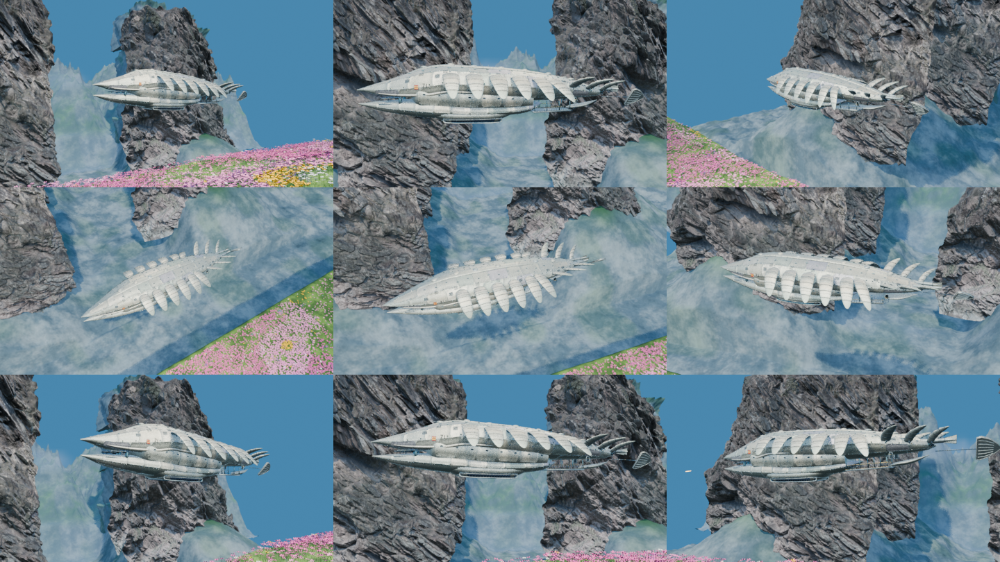

三组新机位 · 运镜预览阶段

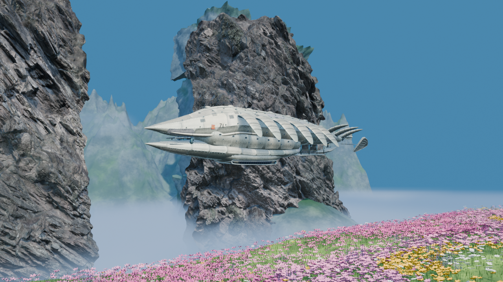

正式渲染首帧 · 补齐岩壁底部与低处云雾

## 01:15–01:25　镜头一：戏剧跟拍

提示词（复盘提炼）：

```text
由远及近接近飞船，再掠过船侧
让速度变化与炮火动作形成节奏
```

接近、掠过、拉远，让飞船有重量。

[观看此镜头](../media/A-dramatic-10s.mp4)

## 01:25–01:30　镜头二：俯冲

提示词（复盘提炼）：

```text
从高位向飞船俯冲
保持主体清晰，突出峡谷纵深
```

从高处俯冲，带出峡谷的纵深。

[观看此镜头](../media/B-high-angle-5s.mp4)

## 01:30–01:35　镜头三：低位掠过

提示词（复盘提炼）：

```text
从花海上方低位仰拍飞船
用前景掠过强化速度与体量
```

花海在前，巨舰从头顶掠过。

[观看此镜头](../media/C-low-pass-5s.mp4)
