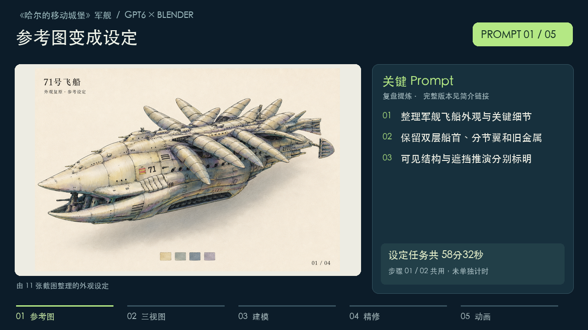
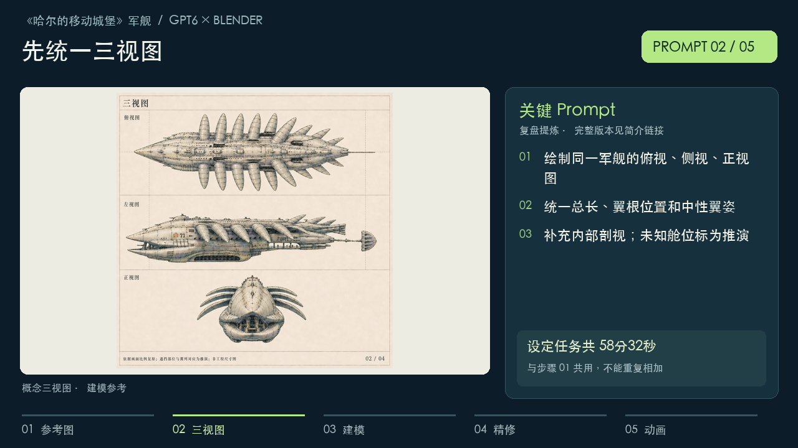
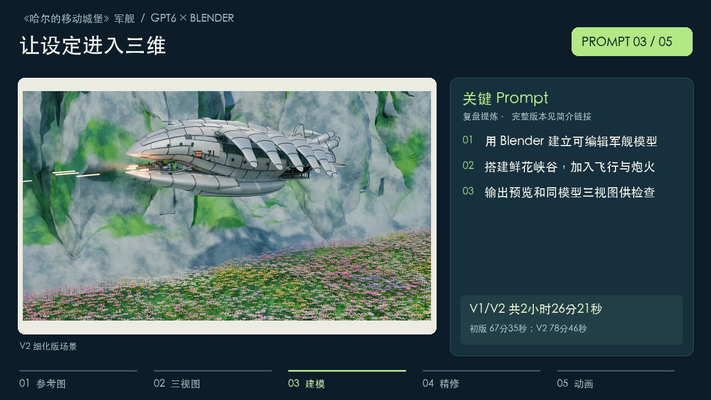
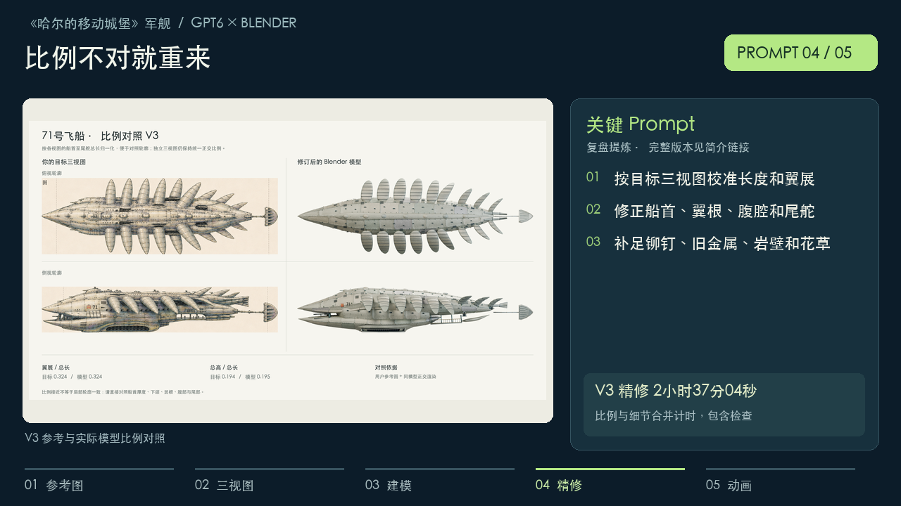
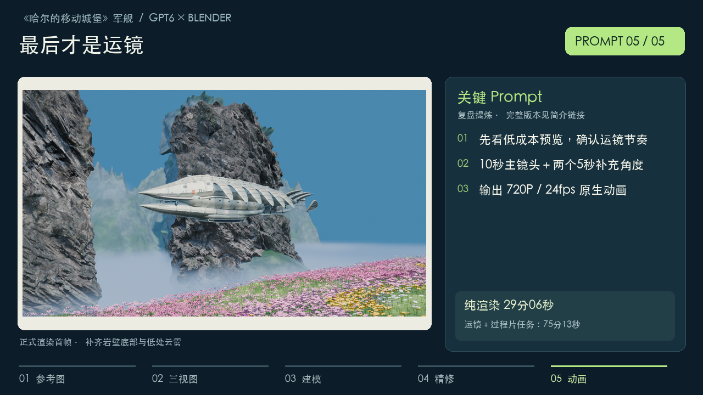

# 几个 Prompt，复刻《哈尔的移动城堡》军舰！

GPT6 建模动画全过程｜制作 Skill 已开源，简介链接获取

视频复刻对象为《哈尔的移动城堡》中的军舰飞船。以下是复盘整理的 5 组主 Prompt；实际制作包含多轮反馈、修正与计算等待。

制作 Skill 已开源：[GitHub 仓库](https://github.com/375432636/gpt6-blender-video-skill) · [获取 Skill](https://github.com/375432636/gpt6-blender-video-skill/blob/main/skills/reference-to-blender-video/SKILL.md)。

## 开场旁白（0–10 秒）

这是《哈尔的移动城堡》里的军舰。几个提示词，就能生成模型和动画。制作 Skill 已开源，简介链接直接获取。

## 每步 Prompt 与耗时

耗时来自本次任务的起止记录及已完成的渲染报告。任务耗时包含分析、执行、等待和检查；纯渲染耗时单独标明。步骤 01/02 属于同一个设定任务，未单独计时，因此只计一次；步骤 04 的比例与细节也不重复相加。

### Prompt 01｜参考图 → 外观设定



**设定任务共 58分32秒**。步骤 01 / 02 共用，未单独计时。

```text
依据我提供的《哈尔的移动城堡》军舰飞船截图，整理外观设定和关键细节。保留双层船首、分节翼列、旧金属装甲、腹底开口、舷侧外廊和 71 号标记。先画完整的三分之四外观，再放大重点部件。可见结构按参考还原，遮挡部分明确标记为推演。
```

### Prompt 02｜三视图 → 内部与细节



**设定任务共 58分32秒**。与步骤 01 共用，不能重复相加。

```text
为同一艘军舰飞船绘制俯视、侧视、正视三视图，保持总长、翼根前后位置和中性翼姿一致。用船首、船尾对齐线检查比例。另绘内部剖视和重点细节，包含拱顶走廊、环框机组、检修栈桥、腹底阵列与外廊。内部位置和连通关系属于推演，需要明确标注。
```

### Prompt 03｜Blender 建模 → 花海峡谷



**V1/V2 共2小时26分21秒**。初版 67分35秒；V2 78分46秒。

```text
用 Blender 把参考设定转成可编辑的军舰飞船模型，放进长满鲜花的峡谷，表现飞行和攻击。先搭建船体、分节翼、尾部、腹腔和外廊，再补材质、岩壁、花草、云雾和灯光。先给场景预览，并从同一模型渲染三视图；根据反馈继续细化，保存工程和生成脚本。
```

### Prompt 04｜校准比例 → 补足细节



**V3 精修 2小时37分04秒**。比例与细节合并计时，包含检查。

```text
模型的长度和比例还不对，请按照目标三视图重新校准总长、翼展、高度和翼根位置，同时修正双层船首、腹腔、外廊和尾舵。比例稳定后补足装甲接缝、铆钉、旧金属材质、岩壁和花草细节。最终场景图、模型三视图和局部细节图必须使用同一套模型。
```

### Prompt 05｜运镜 → 动画输出



**纯渲染 29分06秒**。运镜＋过程片任务：75分13秒。

```text
保留已确认的模型与攻击动作，设计有戏剧张力的运镜：接近飞船、从侧面掠过、向后拉远。先展示低成本预览，再输出 720P、24fps 的 10 秒主镜头。另输出一个高位俯冲角度和一个低位掠过角度，各 5 秒。检查穿模、裁切和主体可见性，最后把完整镜头放入制作过程视频。
```

三个 720P / 24fps 镜头共 480 帧；渲染报告实测 1745.71 秒。75分13秒是包含运镜、配乐、过程片剪辑与交付检查的合并任务时间，不能当作单独的运镜编排耗时。

## 数据出处

- 设定：任务元数据实测 3511.753 秒。
- V1 / V2：4055.010 + 4726.289 = 8781.299 秒。
- V3：两次执行合计 280.227 + 9143.433 = 9423.660 秒，不包含中间停顿。
- 运镜与过程片任务：4512.947 秒；纯渲染：1745.710 秒。

当前修订仅使用已有 3D 镜头，调整片头、提示词与耗时卡和配音。制作耗时是既有制作阶段的记录，不是当前剪辑耗时。
